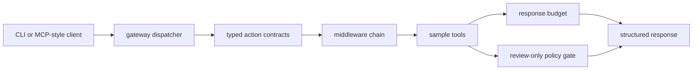

# Portfolio Proof Notes

This page gives reviewers a fast path through the public-safe MCP server patterns in `open-mcpkit`.

## What This Proves

- A small gateway can route typed tool calls without exposing live account connectors.
- Middleware can enforce response budgets and policy checks before outputs leave the tool boundary.
- Dry-run policy decisions can be represented as first-class tool results.
- CLI smoke commands can verify the same primitives a reviewer would expect from an MCP-style server.

## Architecture Diagram



## Five-Minute Reviewer Path

```bash
git clone https://github.com/hairglasses/open-mcpkit.git
cd open-mcpkit
make ci
go run ./cmd/open-mcpkit manifest
go run ./cmd/open-mcpkit call sample_policy_check --param action=delete --param risk=high
```

Then inspect `docs/ARCHITECTURE.md`, `docs/EXAMPLES.md`, and `PUBLIC_BOUNDARY.md`.

## Walkthrough Or Demo Plan

1. Show the manifest to introduce the tool surface.
2. Call `sample_echo` for the happy path.
3. Call `sample_launch_plan` to show planning as data.
4. Call `sample_policy_check` with high risk and explain why review is required.
5. Show `make ci` running tests, vet, build, smoke, and public-boundary checks.

## Trust Boundary

Included public state: synthetic tool names, explicit parameters, sample responses, policy outcomes, and deterministic smoke outputs.

Excluded private state: production framework code, private repository names, live connectors, OAuth state, browser state, tenant data, application data, and local machine paths.

## Tradeoffs

- The repo keeps tools small so contracts and middleware are obvious. It does not try to be a full production framework.
- The policy gate is review-only. That demonstrates the safety pattern without pretending a sample can enforce every real-world policy.
- Response budgeting is deterministic and local, which makes it easy to test but intentionally avoids external observability dependencies.

## Interview Deep-Dive Prompts

- Where should policy gates live: inside tool handlers, middleware, or caller orchestration?
- How would you version typed tool contracts when clients and servers deploy independently?
- What should happen when a tool result is too large for the response budget?
